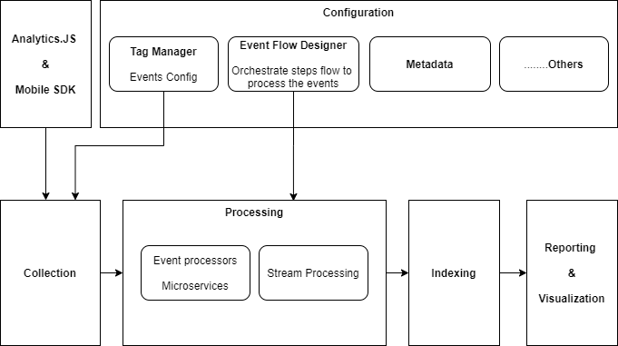
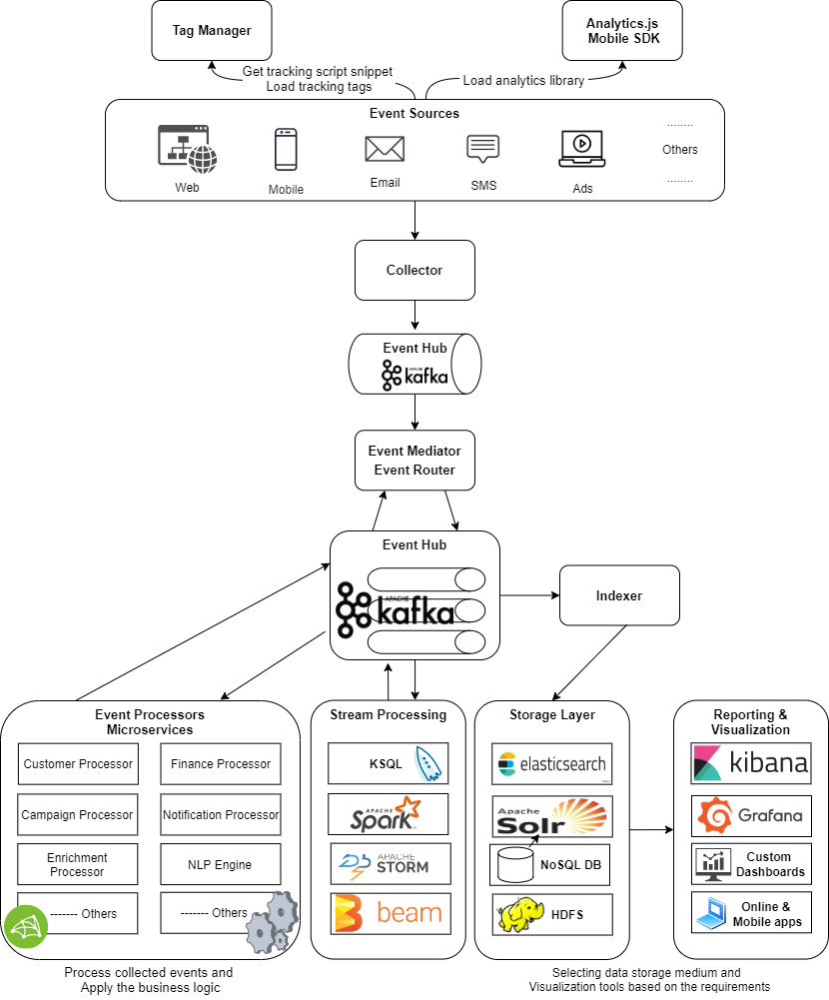

# Event Streaming Analytics Platform

A real-time event analytics platform that tracks the behavior and actions of your visitors. 

It enables immediate exploration, analyzing, processing, and visualization of behavioral / event data, so you can maximize the value of behavioral data that meets the needs of your business today and in the future.

It provides an understanding of the customer journey on the site or apps, which helps you improve visitor alerts that send you a notification when an important visitor returns to the website or mobile app.

Also allows you to track the most important metrics, campaign activity, and paid traffic analytics that helps you improve and optimize your paid advertising campaigns against the objective. 

## Table of contents
* [Architecture](#architecture)
* [Event Streaming Analytics Platform Components](#event-streaming-analytics-platform-components)
* [Event Streaming Analytics Pipeline](#event-streaming-analytics-pipeline)
* [References](#references)
* [Acknowledgments](#acknowledgments)

## Architecture
### Structural Architecture: 
The basic architecture behind the functionality of the proposed Platform structurally is broken down into a set of components as in the following diagram.

The structural architecture of the proposed event streaming analytics platform.

### Pipeline Architecture: 
The next diagram shows the pipeline of the proposed event streaming analytics platform.

The overall pipeline architecture of the proposed event streaming analytics.

## Event Streaming Analytics Platform components
The event streaming analytics pipeline is pluggable and you can add a new component or remove one. The system and the storage backend can scale horizontally

The platform as in the structural architecture comprises the following main components:

### Configuration
The settings that customize the events being fired and the data you want to collect. Set up the events pipeline with rules for processing events.

The configuration has the following sub-components:

#### Tag Manager
Tag Manager allows users to manage analytics tags on websites and mobile apps quickly and easily. It allows users to add all tracking codes without involving too much development team. Instead of updating all tracks on the website, you can use the tag manager interface to decide which code you want to install on the website or mobile app. 

Tag Manager has three main processes:
- Tag: The code which you want to place on the website pages, usually it is a JavaScript code.
- Trigger: When and where you want to place the code
- Variables: Repeated information that you need for tags and triggers.

**Implementation**:
- Through custom development, we can develop our `Tag Manager`.

- `Google Analytics` is a powerful analytics system that provides `Google Tag Manager` to implement all tracking tags with ease and efficiency. 

    Google Analytics may give you free access to their services but in turn, they’re assembling data profiles on your website visitors, which they can then use for better targeting of advertisements across their network. If you want to keep control of your data, you need a tool that you can control. You won’t get that from Google Analytics. You can review these docs about [Why You Should Consider Using Google Analytics Alternatives](https://kinsta.com/blog/google-analytics-alternatives/#why).

- There are many `Open Source` alternatives to Google Analytics, we can use one of them and we can customize it for our business needs.
  * [Top 5 open source alternatives to Google Analytics](https://opensource.com/article/18/1/top-5-open-source-analytics-tools).
  * [13 Best Google Analytics Alternatives for Powerful Data Gathering](https://kinsta.com/blog/google-analytics-alternatives/).
  * [Plausible: Open source Google Analytics alternative](https://plausible.io/open-source-website-analytics).

#### Event Processors Flow Designer
- Used to orchestrate the steps flow to process the fired events. 

- Modeling the event driven process pipeline which includes rules to determine the required event processors or microservices for processing events.

#### Metadata
Define all required metadata for platform components.

### Analytics.JS and Mobile SDK
Mobile SDK and JavaScript library for measuring websites and mobile apps traffic and analyzing visitor's behavior.

It parses and fires analytic tags, and gathers user interaction data (page views, Visits/Sessions, e-commerce transactions, site content, ..... etc) from the client-side tier of your websites and mobile apps, and sends collected data to the collector service.

**Implementation**:
- We can develop our analytics.js library and SDK for different mobile types.
- There are a lot of open-source libraries to do event tracking available on `Github`: [analytics-tracking: https://github.com/topics/analytics-tracking](https://github.com/topics/analytics-tracking). 
we can use one of them, without the need to fully develop it and we can customize it for our business needs.

### Collection
- Analytics library, tags, and tracking code on the client-side gather user interaction data and send it to collector service which produces all incoming event data has to the event hub. 
- Then `event mediator/router` routes each specific processing event to an event channel, which is then received and processed by the event processor based on configured event process flow.

### Processing
Includes:
- `Event Processors` to process the collected events and apply the business logic.
- `Stream Processing` for real-time stream processing.

### Indexing
Consumes event data from the event hub and stores it to the required storage media based on the requirement and the target of the system.
- If we need to provide ** Full-text search** we can index data into `Elasticsearch` or `Solar` as a storage backend and use `Kibana` or `Banana` for dashboards and visualization.
- We can also store the data to `NoSQL` databases or `HDFS`.

### Reporting & Visualization 
- Reporting provides access to all the processed events data in the form of infographics through a web interface and also allows you to get the processed event data through reporting API.
- Selecting the data storage medium and visualization tool based on the requirement and the target of the system.

## Event Streaming Analytics pipeline

- The `Tracking script` role is to capture the different actions performed by users browsing the website or mobile app and pushes these events to the collector service.

- `Collector` service: push all the incoming events to a message broker `event hub` for ingestion.

  The event flow starts with a client sending an event to the collector, which is used to transport the event to the `event hub`.

- `Message broker/event hub`: A message broker is there to allow for the asynchronous processing of the data. One of the most popular message brokers for data is `Apache Kafka`. 

- The `event mediator/router` is responsible for `orchestrating the steps` contained within the initial event recieved from the `event hub`. 

  For each step in the initial event, the event mediator sends out additional asynchronous processing events to `event channels` to execute each step of the process on event processes flow by the `event processors/microservices`.

  The event mediator doesn’t actually perform the business logic necessary to process the initial event; rather, it knows of the steps required to process the initial event.

  The mediator sends a message, get the reply, and send another message based on the reply to the next processor/microservice.

  The mediator is responsible to control the flow by setting the next queue so the next processor/microservice can pick it up.

- `Event processors/microservices` 
  The event processor components contain the application business logic necessary to process the processing event. 

  Event processors/microservices are self-contained, independent, highly decoupled architecture components that perform a specific task in the application or system.

  * `Event processors`, which listen on the `event channels`  in the event hub, receive the event from the `event mediator`, execute a specific business logic to process the event, and replying.

  * `Stream processing` can directly consume the data stream to compute real-time aggregates or filter the stream.

- `Indexer`: will take the incoming data from the `event hub` and push it to the storage layer.

- `Storage Layer`: The storage layer provides long term storage for the incoming event data.

- After aggregating and organizing data, `reporting views` are built from where the Analytics can be presented to the end-user.

  On the front-end, users have the flexibility to query, filter, group, and consume the data in a variety of formats.

## References

- [Building an Event-Driven Messaging Brocker](https://www.irjet.net/archives/V7/i6/IRJET-V7I6733.pdf)
- [Chapter 2. Event-Driven Architecture](https://www.oreilly.com/library/view/software-architecture-patterns/9781491971437/ch02.html)
- [Micro-Services and Mediator Pattern](https://www.linkedin.com/pulse/micro-services-mediator-pattern-eran-shaham/)
- [Using Apache Kafka as a Scalable, Event-Driven Backbone for Service Architectures](https://www.confluent.io/blog/apache-kafka-for-service-architectures/)
- [What is an Event-Driven Architecture?](https://aws.amazon.com/event-driven-architecture/)
- [4 Key Components of a Streaming Data Architecture (with Examples)](https://www.upsolver.com/blog/streaming-data-architecture-key-components)
- [Building Microservices Through Event-Driven Architecture, Part 6: Implementing EventSourcing on Domain Model](https://dzone.com/articles/building-microservices-through-event-driven-archit-4#)
- [Event-Driven Architecture and Its Application in Java - Part 2](https://blog.avenuecode.com/event-driven-architecture-and-its-application-in-java-part-2)
- [Everything Should Know About Google Tag Manager.](https://www.adlift.com/in/blog/everything-should-know-about-google-tag-manager/)
- [Web Analytics](http://www.websell.com.sg/web-analytics-2/)
- [4 Pillars of Analytics](https://medium.com/analytics-and-data/4-pillars-of-analytics-1ee79e2e5f5f)
- [Google Analytics Architecture Explained for Beginners](https://marketlytics.com/blog/understanding-google-analytics-architecture/)
- [How to collect the data you need to bootstrap your digital marketing analytics](https://dev.to/julienkervizic/how-to-collect-the-data-you-need-to-bootstrap-your-digital-marketing-analytics-hhm)
- [Data Flow Architecture Presentation Design](https://www.slideteam.net/technology-ppt-slides/data-flow-architecture-presentation-design.html)
- [Using clickstream event collectors to complement your Google Analytics](https://medium.com/analytics-and-data/using-clickstream-event-collectors-to-complement-your-google-analytics-777bd7aad61)
- [Top 5 open source alternatives to Google Analytics](https://opensource.com/article/18/1/top-5-open-source-analytics-tools)
- [13 Best Google Analytics Alternatives for Powerful Data Gathering](https://kinsta.com/blog/google-analytics-alternatives/)
- [Plausible: Open source Google Analytics alternative](https://plausible.io/open-source-website-analytics)
- [analytics-tracking](https://github.com/topics/analytics-tracking)
- [SNOWPLOW: Full Setup with Google Analytics Tracking](https://www.simoahava.com/analytics/snowplow-full-setup-with-google-analytics-tracking/)
- [Building a Streaming Analytics Stack with Apache Kafka and Druid](https://www.confluent.io/blog/building-a-streaming-analytics-stack-with-apache-kafka-and-druid/)

## Acknowledgments
Thanks for your time to read this doc. 
